## Part 0.9. Установка Docker

#### Перед началом установки обновим базу пакеты
    sudo apt update
#### Следующим шагом будем установка необходимых пакетов для корректной работы docker 
    sudo apt install apt-transport-https ca-certificates curl software-properties-common
#### Добавляем ключ GPG официального репозитория Docker:
    curl -fsSL https://download.docker.com/linux/ubuntu/gpg | sudo apt-key add -
#### Подключаем репозиторий Docker 
    sudo add-apt-repository "deb [arch=amd64] https://download.docker.com/linux/ubuntu focal stable"
#### После добавления нового репозитория обязательно обновим базу пакетов, иначе при выполнении команды установки система не будет знать что этот пакет доступен
    sudo apt update
#### Приступим к установке Docker
    sudo apt install docker-ce
#### После установки Docker проверим, запущен ли демон 
    sudo systemctl status docker
#### После выполнения команды вы должны получить примерно следующее

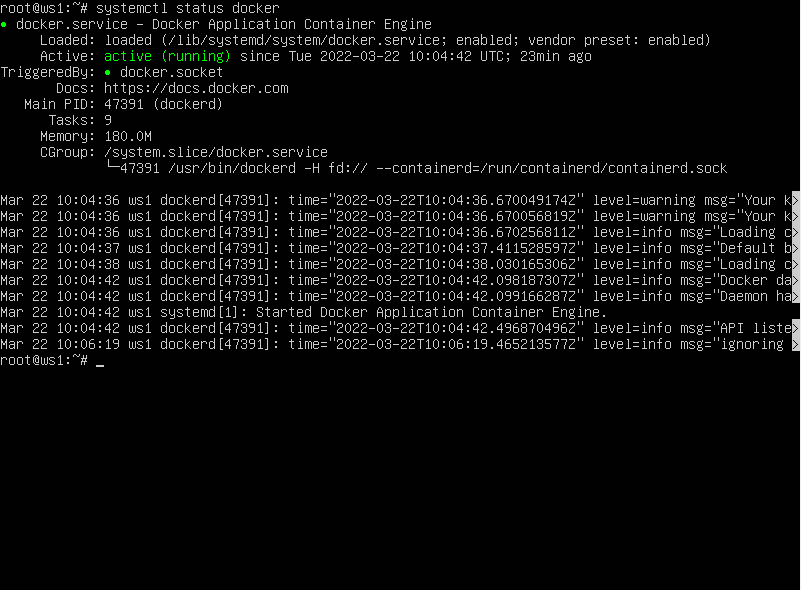

#### На этом установка Docker завершена. 

## Part 1. Готовый докер

#### 1. Взять официальный докер образ с nginx и выкачать его при помощи `docker pull`
    sudo docker pull nginx

#### 2. Проверить наличие докер образа через `docker images`
    sudo docker images
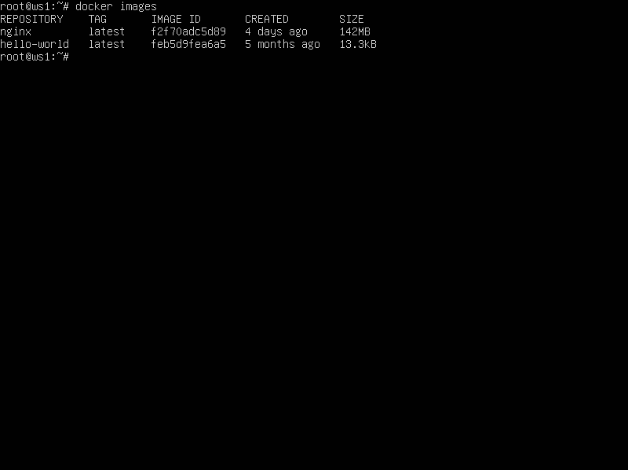

#### 3. Запустить докер образ через `docker run -d [image_id|repository]`
    sudo docker run -d nginx
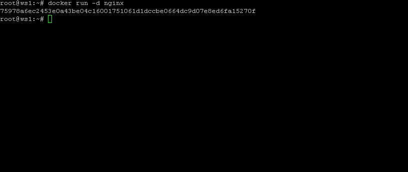

#### 4. Проверить, что образ запустился через `docker ps`
    sudo docker ps
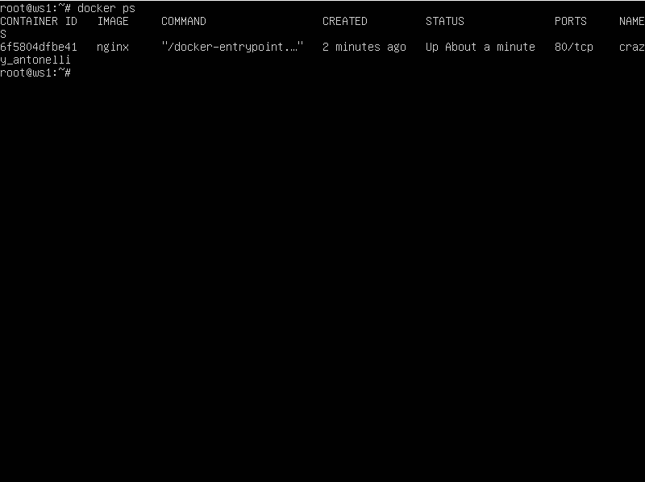

#### 5. Посмотреть информацию о контейнере через `docker inspect [container_id|container_name]`
    sudo docker inspect crazy_antonelli
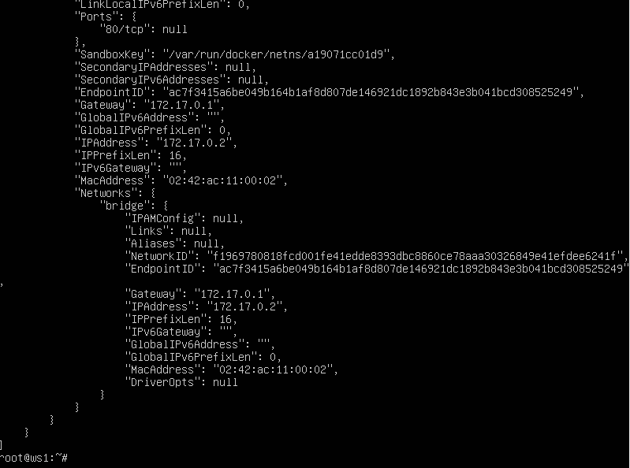

#### 6. Нужные нам данные после предыдущей команды
    размер контейнера - 1.09Kb (virtual 142Mb)
    список замапленных портов - 80/tcp
    ip контейнера - 172.17.0.2/16

#### 7. Остановить докер образ через `docker stop [container_id|container_name]`
    sudo docker stop crazy_antonelli
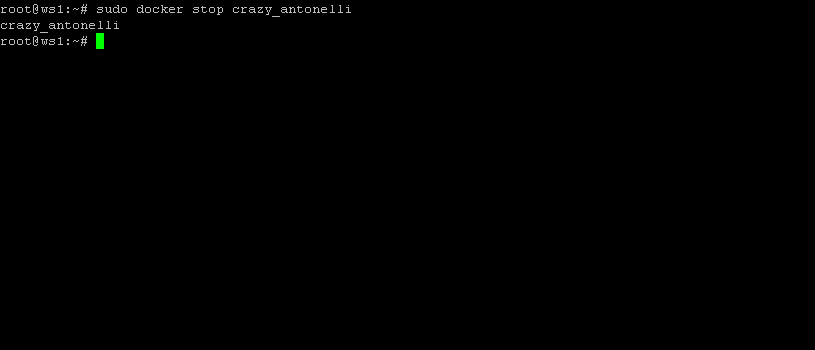

#### 8. Проверить, что образ остановился через `docker ps`
    sudo docker ps -as
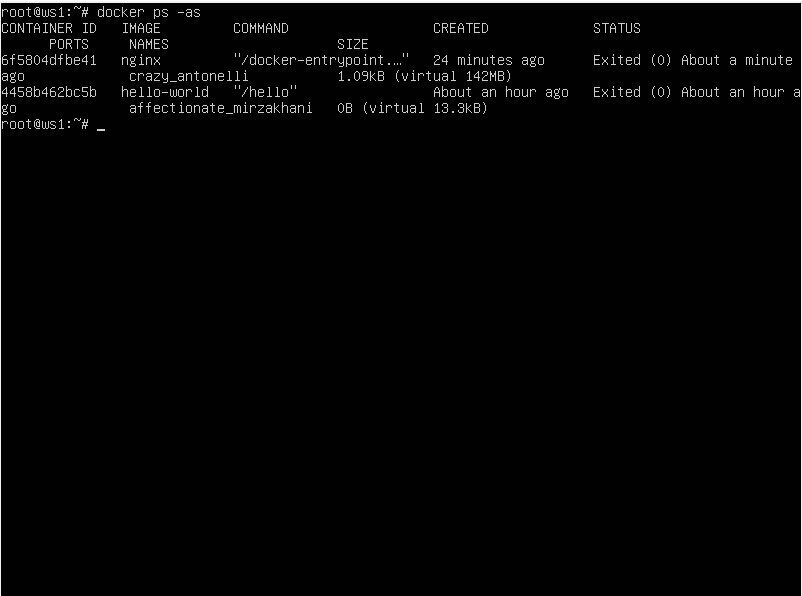

#### 9. Запустить докер с замапленными портами 80 и 443 на локальную машину через команду *run*
    sudo docker run -p 80:80 -p 443:443 -d nginx
#### 10. Проверить, что в браузере по адресу *localhost:80* доступна стартовая страница **nginx**
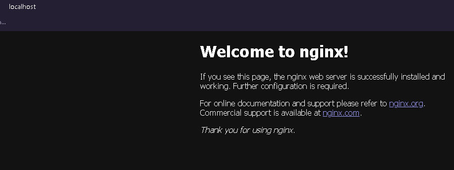

#### 11. Перезапустить докер контейнер через `docker restart [container_name|container_id]`
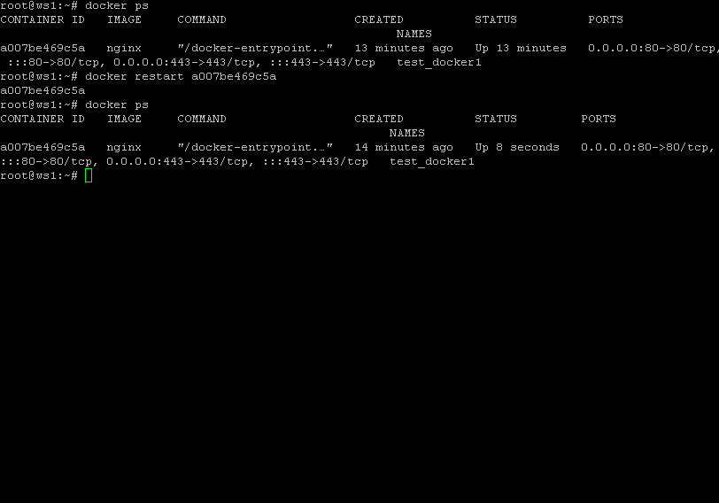

## Part 2. Операции с контейнером

#### 1. Прочитать конфигурационный файл *nginx.conf* внутри докер образа через команду *exec*
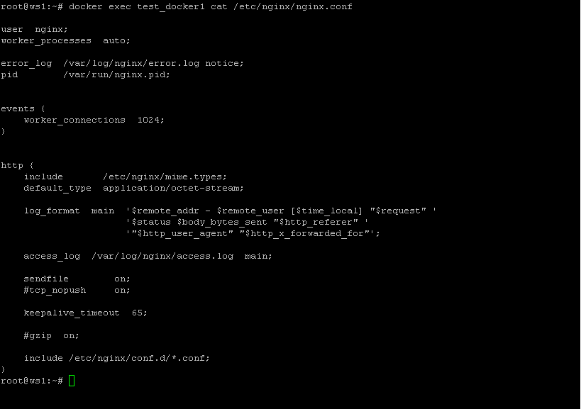

#### 2. Создать на локальной машине файл *nginx.conf*
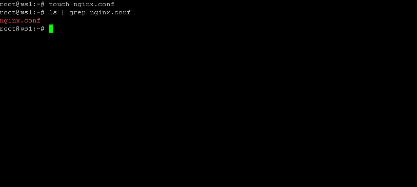

#### 3. Настроить в нем по пути */status* отдачу страницы статуса сервера **nginx**
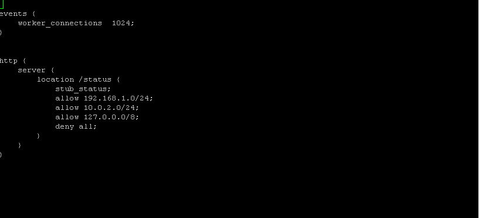

#### 4. Скопировать созданный файл *nginx.conf* внутрь докер образа через команду `docker cp`
    Удалим старый nginx.conf командой: 
    sudo docker exec [container_name] rm -rf /etc/nginx/nginx.conf

    Cкопируем наш nginx.conf командой:
    sudo docker cp nginx.conf [container_name]:/etc/nginx/
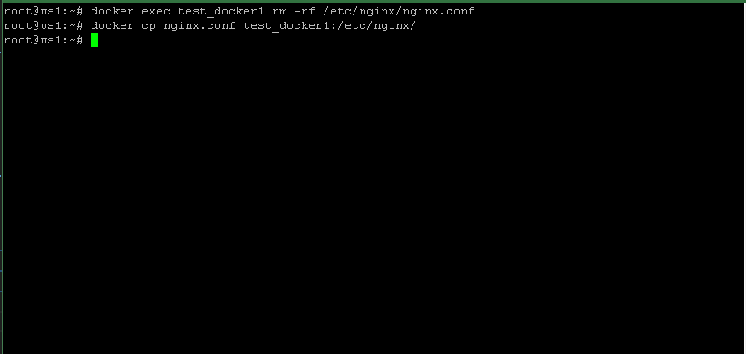

#### 5. Перезапустить **nginx** внутри докер образа через команду *exec*
Можно использовать одну из трёх, или сразу три подряд, если не уверены.

    sudo docker exec [container_name] nginx -s reload
    sudo docker exec [container_name] service nginx reload
    sudo docker exec [container_name] service nginx restart
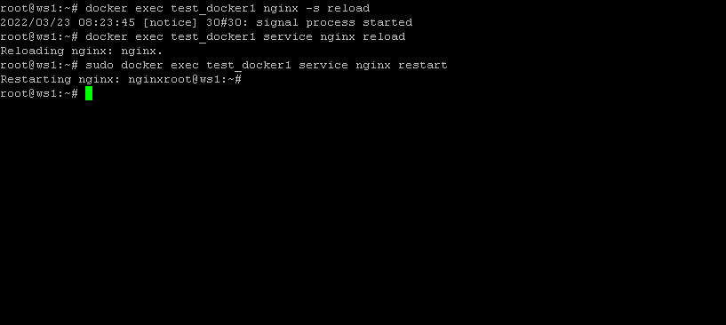

#### 6. Проверить, что по адресу *localhost:80/status* отдается страничка со статусом сервера **nginx**
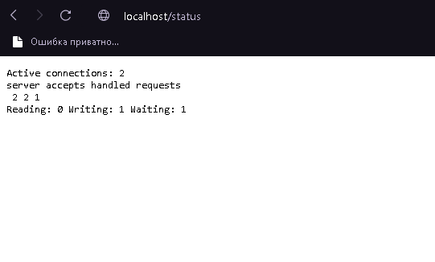

#### 7. Экспортировать контейнер в файл *container.tar* через команду *export*

    sudo docker export -o="container.tar" [container_name]
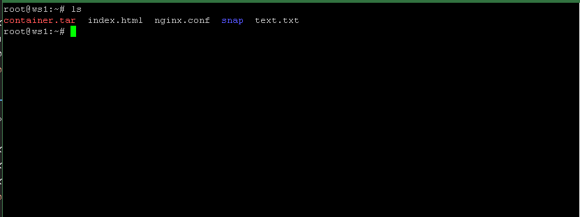

#### 8. Остановить контейнер

    sudo docker stop [container_name]
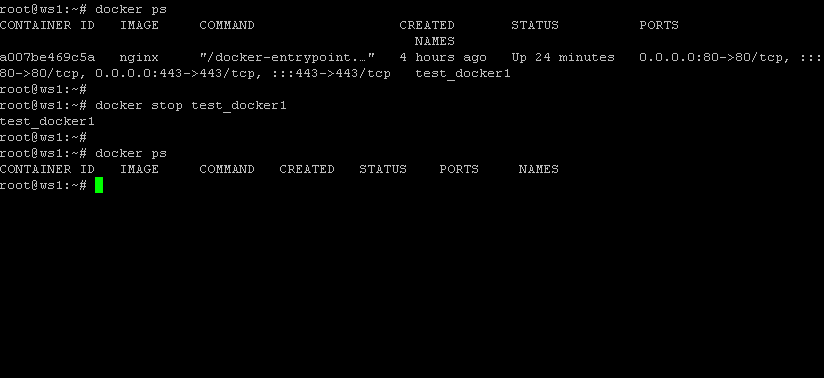

#### 9. Удалить образ через `docker rmi [image_id|repository]`, не удаляя перед этим контейнеры

    sudo docker rmi -f [image_id|repository]
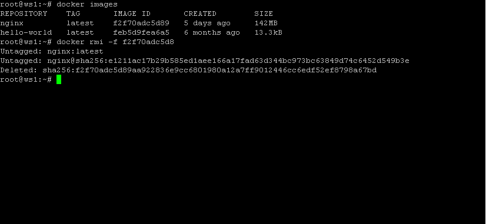

#### 10. Импортировать контейнер обратно через команду *import*

    sudo tar -o container.tar | docker import - container
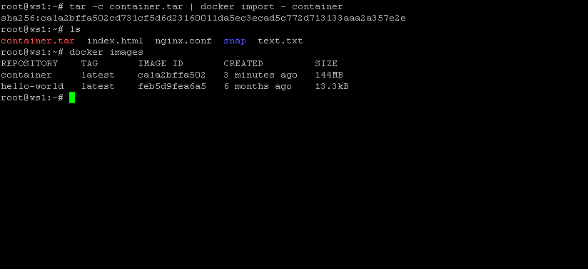

#### 11. Запустить импортированный контейнер

Просто написать команду `sudo docker run [id_image]` на этот раз не получится.
Залезаем в наш изначальный контейнер с помощью `sudo docker inspect [id_container]`
и смотрим PATH и ARGS, без них наш импортированый image не запустится.

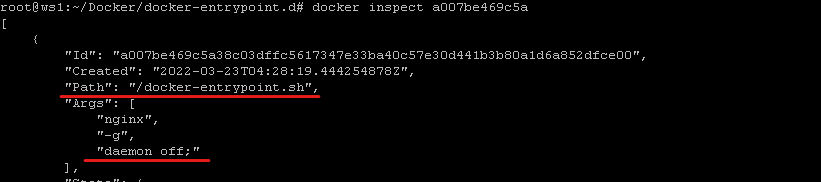

    sudo docker run -d -p 80:80 -p 443:443 --name finnaly container:latest /docker-entrypoint.sh  nginx -g "daemon off;"

##### Контейнер полность работает и все настройки в нём сохранились.
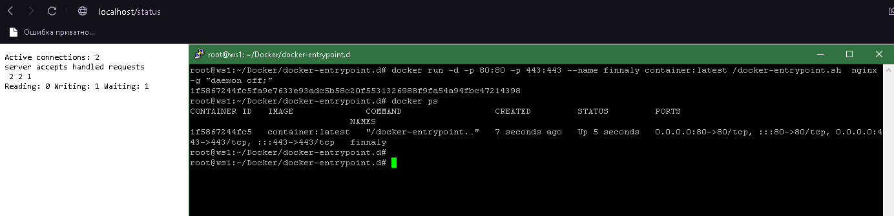
